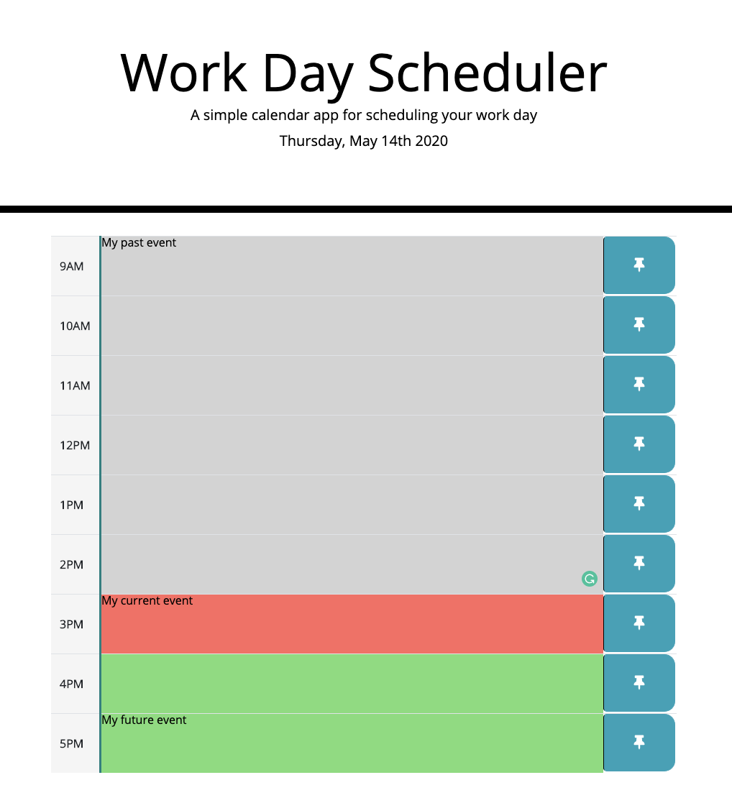

# Work day Scheduler

This project hosts the source code for my Work Day Scheduler. A simple calendar application that allows the user to save events for each hour of the day.

### The following animation demonstrates the application functionality:



## Installing / Getting Started

To test this project, simply clone project into a your local file system and open `index.html` in your favorite browser.

```
git clone https://github.com/ystamaritq/work-day-scheduler.git
cd work-day-scheduler
open index.html

```

---

### Initial Configuration

No additional setup required.

## Developing

Below is a summary of the key files for this project and their purpose:

- **index.html** work-day-scheduler html page
- **assets** folder that contains all files
- **assets/js/script.js** javascript files
- **assets/img/..** images used by the page
- **assets/css/style.css** main site custom stylesheet

## Additional Libraries:

- **Bootstrap**
- **jQuery**

## Features

In this work day scheduler the current day is displayed at the top of the calendar. You can create a event during the regular working hours from 9:00 AM to 5:00 PM. If the event is in the past hours the time block will be gray, if the event is in the current hour the time block will be red , or if the event is in the future the time block will be green.

## Licensing

"The code in this project is licensed under MIT license."

---

**developed with love by **@ystamaritq\*\*\*\*
